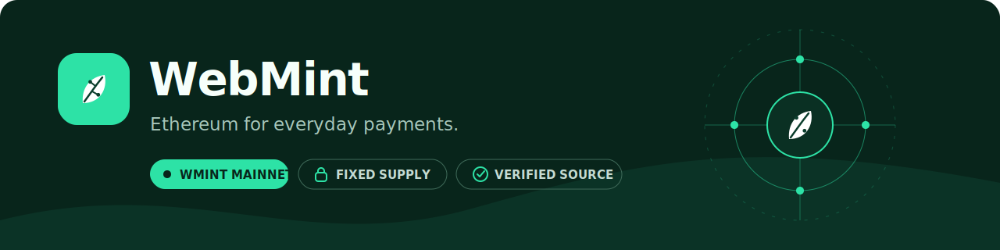

<p align="center">
  <a href="https://wmint.org">
    
  </a>
</p>

<p align="center">
  <a href="https://wmint.org"></a>
  <a href="https://etherscan.io/token/0x44F725Fdf509788E123fc79881174f940B8dbdE1#code"></a>
  <a href="https://t.me/web_mint"></a>
  <a href="https://x.com/blockHunt4r"></a>
</p>

## Building payment infrastructure on Ethereum

WebMint is developing an Ethereum Layer 2 for everyday payments, creator
payouts and consumer applications. The platform is designed around familiar
Ethereum tooling, smart accounts, sponsored fees and application APIs.

WMINT is the fixed-supply Ethereum token for the WebMint ecosystem.

<table>
  <tr>
    <td width="33%"><strong>Live today</strong><br><br>WMINT on Ethereum Mainnet with verified source code.</td>
    <td width="33%"><strong>Built for products</strong><br><br>Payments, creator payouts and consumer application flows.</td>
    <td width="33%"><strong>Developer direction</strong><br><br>JSON-RPC, SDKs, WalletConnect, smart accounts and APIs.</td>
  </tr>
</table>

## WMINT at a glance

| Property | Value |
|---|---|
| Network | Ethereum Mainnet |
| Contract | [`0x44F725Fdf509788E123fc79881174f940B8dbdE1`](https://etherscan.io/token/0x44F725Fdf509788E123fc79881174f940B8dbdE1#code) |
| Supply | 1,000,000,000 WMINT, fixed at deployment |
| Standard | ERC-20, Burnable, EIP-2612 Permit |
| Controls | No owner, mint, pause, blacklist or proxy upgrade |

## Development roadmap

```text
Ethereum Mainnet token  [ complete ]
Public documentation    [ active   ]
Network specification   [ active   ]
Public testnet           [ planned  ]
SDK and wallet examples [ planned  ]
Payment and payout APIs [ planned  ]
```

### Planned developer stack


## Official resources

- Website: [wmint.org](https://wmint.org)
- Litepaper: [wmint.org/litepaper](https://wmint.org/litepaper/)
- Documentation: [wmint.org/docs](https://wmint.org/docs/)
- Etherscan: [verified WMINT contract](https://etherscan.io/token/0x44F725Fdf509788E123fc79881174f940B8dbdE1#code)
- Telegram: [@web_mint](https://t.me/web_mint)
- X: [@blockHunt4r](https://x.com/blockHunt4r)
- Email: [hello@wmint.org](mailto:hello@wmint.org)

<p align="center">
  <sub>Always verify the complete contract address through wmint.org or Etherscan.</sub>
</p>
